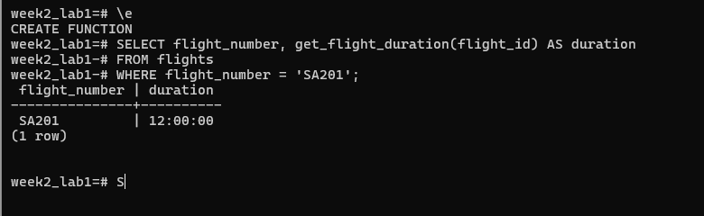
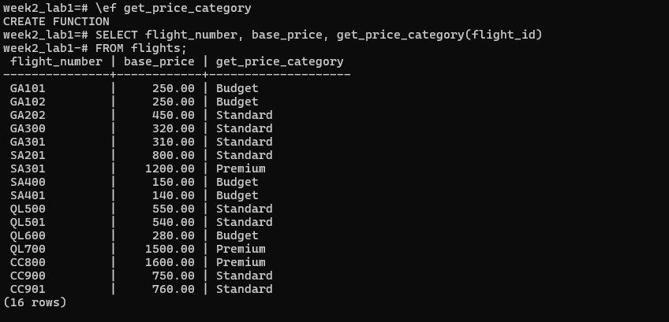

# Activity 1 - Goal: Create a SQL function that calculates the duration of a flight.

Task: Write a PL/pgSQL function called get_flight_duration that accepts a flight ID and returns the flight's duration as an INTERVAL.

# Activity 2 - Goal: Use an IF statement to categorize flights based on their price.

Task: Write a function called get_price_category that takes a flight ID, checks its base_price, and returns a TEXT category:

- 'Budget' if the price is less than $300.
- 'Standard' if the price is between $300 and $800 (inclusive).
- 'Premium' if the price is more than $800.

# Activty 3 - Goal: Create a procedure to handle the action of booking a flight for a passenger.

Task: Write a procedure book_flight that takes a passenger ID, a flight ID, and a desired seat number. The procedure should insert a new record into the bookings table with a 'Confirmed' status and the current date.

Hint: Unlike a function, a procedure does not return a value. It is called using the CALL command.

# Activty 4 - Goal: Use a FOR loop to iterate through a query's results and perform an update.

Task: Create a procedure increase_prices_for_airline that accepts an airline ID and a percentage increase. The procedure should find all flights belonging to that airline and increase their base_price by the given percentage.

Hint: You can declare a record variable to hold each row from the SELECT query inside the loop.

