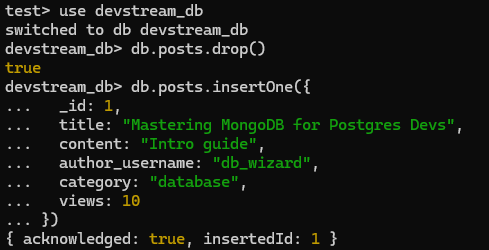
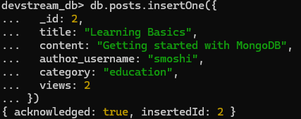
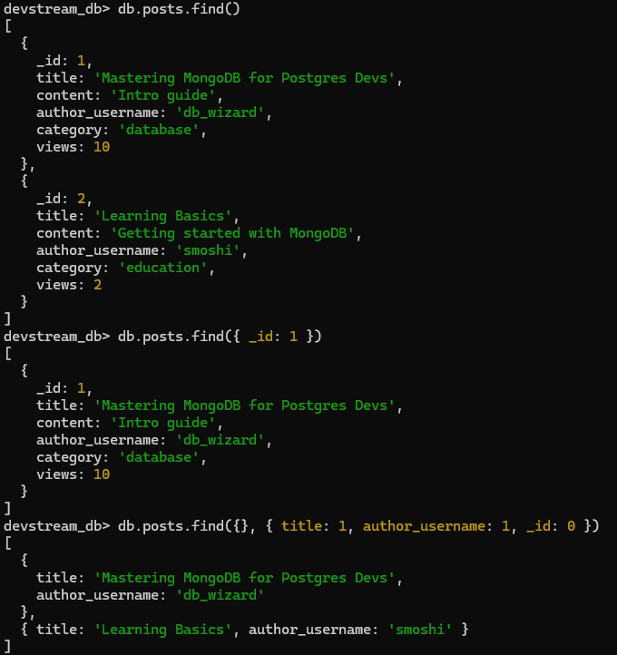
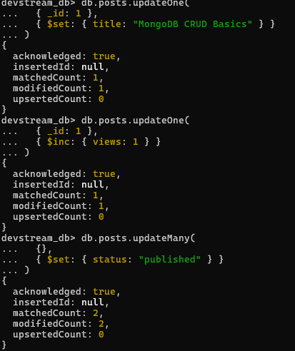
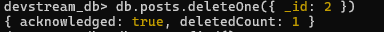

# Activity 10 Solution


## Part 1: Quick Mapping (Postgres -> MongoDB)

| PostgreSQL | MongoDB Equivalent |
|---|---|
| `INSERT INTO posts ...` | `db.posts.insertOne({...})` |
| `SELECT * FROM posts WHERE title='...'` | `db.posts.find({ title: "..." })` |
| `UPDATE posts SET title='...' WHERE id=...` | `db.posts.updateOne({ _id: ... }, { $set: { title: "..." } })` |
| `DELETE FROM posts WHERE id=...` | `db.posts.deleteOne({ _id: ... })` |

## Part 2: Hands-on CRUD in MongoDB

Write the commands you executed and paste screenshots from Mongo shell after each command/block.

### 2.1 Setup

Commands:

```javascript
commands:
use devstream_db
db.posts.drop()
db.posts.insertOne({...})

test> use devstream_db
switched to db devstream_db
devstream_db> db.posts.drop()
true
devstream_db> db.posts.insertOne({
...   _id: 1,
...   title: "Mastering MongoDB for Postgres Devs",
...   content: "Intro guide",
...   author_username: "db_wizard",
...   category: "database",
...   views: 10
... })
{ acknowledged: true, insertedId: 1 }
```

Screenshot(s):
- 

### 2.2 Create

Commands:

```javascript
commands:
db.posts.insertOne({...})

devstream_db> db.posts.insertOne({
...   _id: 2,
...   title: "Learning Basics",
...   content: "Getting started with MongoDB",
...   author_username: "smoshi",
...   category: "education",
...   views: 2
... })
{ acknowledged: true, insertedId: 2 }
```

Screenshot(s):
- 

### 2.3 Read

Commands:

```javascript
devstream_db> db.posts.find()
devstream_db> db.posts.find({ _id: 1 })
devstream_db> db.posts.find({}, { title: 1, author_username: 1, _id: 0 })

devstream_db> db.posts.find()
[
  {
    _id: 1,
    title: 'Mastering MongoDB for Postgres Devs',
    content: 'Intro guide',
    author_username: 'db_wizard',
    category: 'database',
    views: 10
  },
  {
    _id: 2,
    title: 'Learning Basics',
    content: 'Getting started with MongoDB',
    author_username: 'smoshi',
    category: 'education',
    views: 2
  }
]
devstream_db> db.posts.find({ _id: 1 })
[
  {
    _id: 1,
    title: 'Mastering MongoDB for Postgres Devs',
    content: 'Intro guide',
    author_username: 'db_wizard',
    category: 'database',
    views: 10
  }
]
devstream_db> db.posts.find({}, { title: 1, author_username: 1, _id: 0 })
[
  {
    title: 'Mastering MongoDB for Postgres Devs',
    author_username: 'db_wizard'
  },
  { title: 'Learning Basics', author_username: 'smoshi' }
]
```

Screenshot(s):
- 

### 2.4 Update

Commands:

```javascript
commands: 
db.posts.updateOne({ _id: ... }, { $set: { title: "..." } })


devstream_db> db.posts.updateOne(
...   { _id: 1 },
...   { $set: { title: "MongoDB CRUD Basics" } }
... )
{
  acknowledged: true,
  insertedId: null,
  matchedCount: 1,
  modifiedCount: 1,
  upsertedCount: 0
}
devstream_db> db.posts.updateOne(
...   { _id: 1 },
...   { $inc: { views: 1 } }
... )
{
  acknowledged: true,
  insertedId: null,
  matchedCount: 1,
  modifiedCount: 1,
  upsertedCount: 0
}
devstream_db> db.posts.updateMany(
...   {},
...   { $set: { status: "published" } }
... )
{
  acknowledged: true,
  insertedId: null,
  matchedCount: 2,
  modifiedCount: 2,
  upsertedCount: 0
}
```

Screenshot(s):
- 

### 2.5 Delete

Commands:

```javascript
devstream_db> db.posts.deleteOne({ _id: 2 })
{ acknowledged: true, deletedCount: 1 }
```

Screenshot(s):
- 

Result(update and delete)
```javascript
devstream_db> db.posts.find()
[
  {
    _id: 1,
    title: 'MongoDB CRUD Basics',
    content: 'Intro guide',
    author_username: 'db_wizard',
    category: 'database',
    views: 11,
    status: 'published'
  }
]
```

## Part 3: Reflection (3-4 sentences)

1. One thing that feels easier in MongoDB CRUD:

- MongoDB makes inserting and updating data easier because it uses flexible, JSON-like documents with no strict schema required. This allows quick changes and faster development. In contrast, SQL databases like PostgreSQL require a defined structure, which can slow down changes but ensures better organization and consistency of data.

2. One thing that was clearer in PostgreSQL CRUD:

- PostgreSQL is clearer when working with structured data because everything is strictly defined—tables, columns, and relationships. This forces consistency, which reduces errors and makes complex queries more reliable. While MongoDB offers flexibility, PostgreSQL’s structure provides stronger control and trust in the data, especially in systems where accuracy matters most.