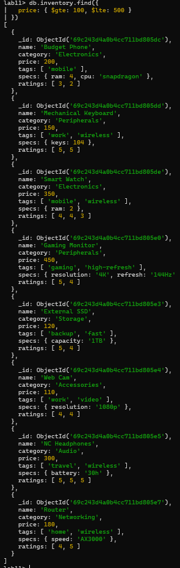
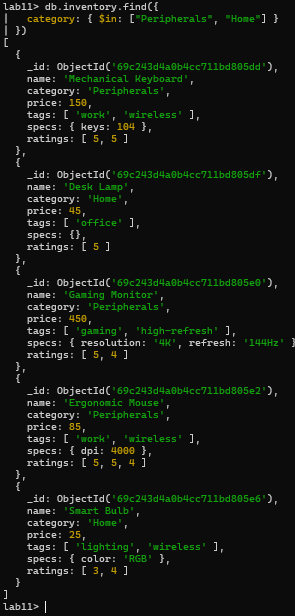
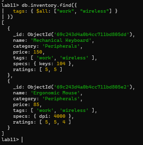
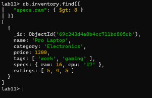
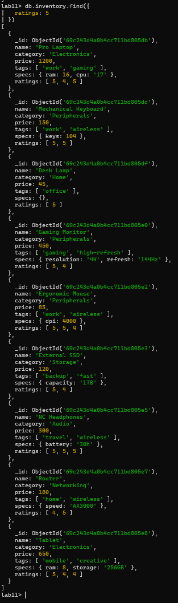

# Activity 11: SQL to MongoDB & Advanced Querying - Answer Template

## Part 1: Relational to Document Modeling

### 1. Proposed JSON Schema (`posts` collection)
```json
// Provide your single document structure here
{
  "_id": "...",
  "title": "...",
  "body": "...",
  "created_at": "...",
  "author": {
    "id": 1,
    "username": "smoshi",
    "email": "smoshi@gmail.com",
    "bio": "Full-stack eater"
  },
  "tags": [
    { "id": 1, "name": "manok" },
    { "id": 2, "name": "cookie" }
  ]
}
```

### 2. Strategic Choices
*   **Tags:** (Embed / Reference) - Embed
*   **Author:** (Embed / Reference) - Embed

### 3. Justification
> Embedding tags and author information keeps each post self-contained, reflecting how users typically access this data together. This reduces the need for extra queries, speeds up reading posts, and simplifies the database structure. It also aligns with real usage patterns, ensuring the model remains efficient and scalable as the number of posts grows.

---

## Part 2: Querying with MQL Operators

### 1. Price Range
*Find all items priced between $100 and $500 (inclusive).*
```javascript
// Your MQL Command
db.inventory.find({ 
  price: { $gte: 100, $lte: 500 } 
})
```

### 2. Category Match
*Find all items that are in either the "Peripherals" or "Home" categories.*
```javascript
// Your MQL Command
db.inventory.find({ 
  category: { $in: ["Peripherals", "Home"] } 
})
```

### 3. Tag Power
*Find all items that have **both** the "work" AND "wireless" tags.*
```javascript
// Your MQL Command
db.inventory.find({ 
  tags: { $all: ["work", "wireless"] } 
})
```

### 4. Nested Check
*Find all items where the `specs.ram` is greater than 8GB.*
```javascript
// Your MQL Command
db.inventory.find({ 
  "specs.ram": { $gt: 8 } 
})
```

### 5. High Ratings
*Find all items that have at least one `5` in their `ratings` array.*
```javascript
// Your MQL Command
db.inventory.find({ 
  ratings: 5 
})
```

---

## Screenshots
### Part 2
### 1. Price Range


### 2. Category Match


### 3. Tag Power


### 4. Nested Check


### 5. High Ratings



