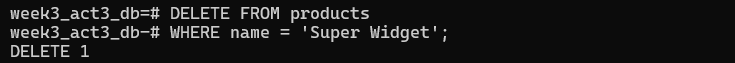
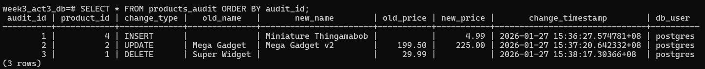
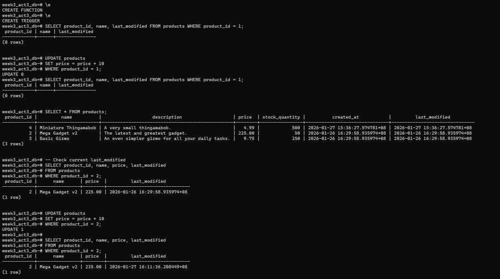

# Task 1: Create the Trigger Function
Create a PL/pgSQL function named log_product_changes() that returns type TRIGGER. This function will contain the logic for handling the different event types.

# Task 2: Create the Trigger Definition
Create a trigger named product_audit_trigger that binds your log_product_changes() function to the products table.

# Task 3: Test Your Trigger
After creating the function and the trigger, perform the following SQL operations to test your work:

# Task 4: Verify the Results
Check the contents of your products_audit table. You should see three new rows corresponding to the INSERT, the meaningful UPDATE, and the DELETE.

# Bonus Challenge: Automatically Update last_modified
The products table has a last_modified column. Create a second, separate trigger to automatically update this column to the current timestamp whenever a row is updated.

Test code:

UPDATE products SET price = price + 10 WHERE product_id = 2;

