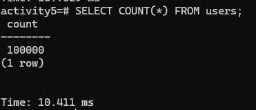
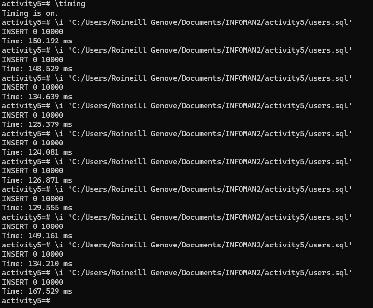
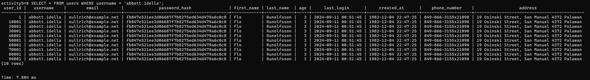
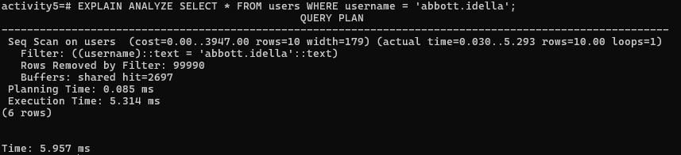
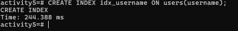
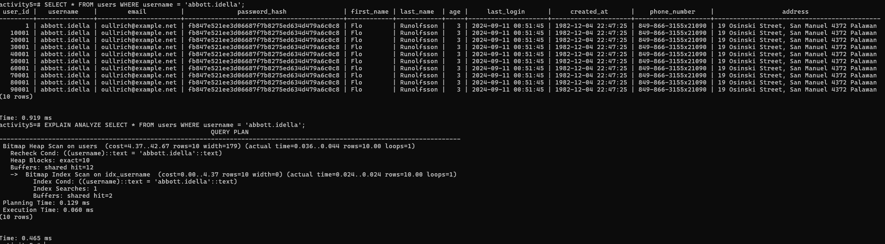
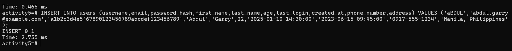

# Part 1 Verify Row Count:

# Insert with time

# Part 2 Querying Without an Index
SELECT * FROM your_table_name WHERE your_string_column = 'some_random_value';

EXPLAIN ANALYZE SELECT * FROM your_table_name WHERE your_string_column = 'some_random_value';

# Part 3 Creating an Index and Querying
Create an Index:

CREATE INDEX idx_your_column_name ON your_table_name(your_column_name);

Run the SELECT Query Again:

Run the exact same SELECT query as in Part 2.
Again, use EXPLAIN ANALYZE to measure the execution time.
EXPLAIN ANALYZE SELECT * FROM your_table_name WHERE your_string_column = 'some_random_value';

# Part 4 Analyzing Insertion with an Index

Insert a Single Row:

Insert one additional row into your table.

INSERT INTO your_table_name (id, ...) VALUES (...);

Record the time it takes to insert this single row.

# i Analysis Questions

Fill in the following with your recorded measurements.

Initial Data Insertion Time (1,000,000 rows): 167.529 ms

Query Execution Time (Non-Indexed): 5.957 ms

Query Execution Time (Indexed): 0.465 ms (Execution Time 0.060 ms)

Single Row Insertion Time (With Index): 2.755 ms

# ii Answer the following questions:

1. How did the query execution time change after creating the index? Was it faster or slower? By approximately how much?

- After creating the index on the username column, the query execution time became significantly faster. Before the index, selecting a user by username using a sequential scan took around 5.314 ms. After creating the index, the same query executed in about 0.060 ms, showing a dramatic improvement.

2. Why do you think the query performance changed as you observed?

- The performance improved because PostgreSQL uses a B-tree index on the username column. Before the index was created, the database had to perform a sequential scan on all 100,000 rows in the users table to find the matching username, which took about 5 milliseconds. After creating the index, PostgreSQL used a bitmap index scan, allowing it to directly locate the relevant rows without scanning the entire table, reducing the execution time to about 0.06 milliseconds. This demonstrates how B-tree indexes efficiently speed up queries by providing a structured way to quickly find specific data.

3. What is the trade-off of having an index on a table? (Hint: Compare the initial bulk insertion time with the single row insertion time after the index was created).

- The trade-off of having an index is that it slightly slows down data modifications. Based on my psql, inserting a single row after creating the index took about 2.755 ms, whereas bulk inserting 10,000 rows into a table without indexes took roughly 124–167 ms per batch. Maintaining the index adds overhead for each insert, update, or delete operation because the database must update the index structure along with the table data.

